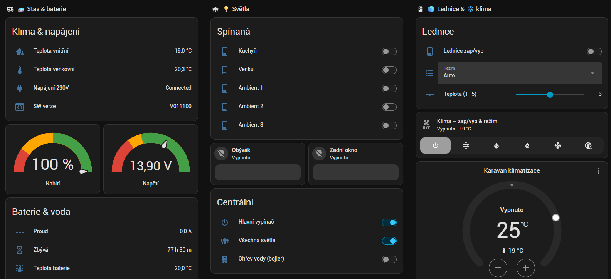

# 🚐 Hobby karavan → Home Assistant (ESP32-C3 / ESPHome / BLE)

Most mezi obytným přívěsem **Hobby De Luxe 495 UL** (ovládací panel *HobbyConnect /
Hobby BT Masterpanel*) a **Home Assistant** přes levný **ESP32-C3**, který se přes
**Bluetooth LE** připojí na řídicí jednotku karavanu a vystaví její data i ovládání
jako nativní entity HA — světla, stmívače, lednici, topení, bojler, baterii a teploty.

Jde o **integraci do Home Assistant přes Wi-Fi a Bluetooth LE prostřednictvím ESP32**:

```
Karavan (panel HobbyConnect)  ──BLE──►  ESP32-C3  ──Wi-Fi──►  Home Assistant
```



Stejný HobbyConnect modul používají i karavany **Fendt**, takže projekt staví na
ESPHome komponentě [`fendt_caravan`](https://github.com/esphome/esphome/pull/13327)
(PR #13327, autor *rawsludge*), kterou jsme **rozšířili** o plnou paritu s mobilní
aplikací HobbyConnect a o **ovládací (WRITE) příkazy**.

> 🌍 Jazyky / Languages / Sprachen: **Česky** (tento dokument) ·
> [English](README.en.md) · [Deutsch](README.de.md)

---

## ✨ Co to umí

| Doména | Entity v HA | Stav |
|--------|-------------|------|
| 🌡️ Teploty | vnitřní, venkovní (°C) | ✅ čtení |
| 🔋 Baterie | napětí, proud, nabití %, zbývající čas | ✅ čtení (`IBS0_*`) |
| 💡 Spínaná světla | kuchyň, venku, ambient 1–3 | ✅ ovládání + stav |
| 🎚️ Stmívače | obývák, ambient zadní okno (jas 0–15) | ✅ ovládání |
| 🔆 Centrální | hlavní vypínač, všechna světla | ✅ ovládání + stav |
| 🔥 Topení | podlahové topení, bojler | ✅ ovládání + stav |
| 🧊 Lednice | zap/vyp · zdroj (Auto/Plyn/12V/230V) · teplota (1–5) | ✅ ovládání |
| 🔌 Napájení | 230 V připojeno, verze SW | ✅ čtení |
| 💧 Nádrž vody | — | ⏳ čeká na zachycení při napouštění |

## ⚡ Co potřebuješ k rozběhnutí

- 🏠 **Home Assistant** — běžící instance
- 🧩 **ESPHome** — nejsnáz jako add-on v HA
- 📡 **ESP32-C3** (s BLE; ⚠️ jen 2,4 GHz Wi-Fi) + USB-C kabel a napájení
- 📶 **2,4GHz Wi-Fi** v dosahu karavanu

👉 **Návod od nuly krok za krokem:** [`docs/getting-started.md`](docs/getting-started.md)

## 🧰 Hardware

- **ESP32-C3** (SuperMini) — pozor, jen **2,4 GHz Wi-Fi** (5 GHz se nepřipojí).
- Karavan **Hobby De Luxe 495 UL** s panelem *HobbyConnect / Hobby BT Masterpanel*.
- BLE zařízení `HobbyConnect Data`, MAC `XX:XX:XX:XX:XX:XX` (najdi si svůj skenem).
- Podrobnosti: [`docs/hardware.md`](docs/hardware.md).

## 🚀 Instalace ve zkratce

1. ESPHome (zde běží jako Docker kontejner na Synology NAS, dashboard na portu 6052).
2. Zkopíruj `esphome/secrets.example.yaml` → `secrets.yaml` a doplň Wi-Fi
   (**`secrets.yaml` necommituj**).
3. První flash přes [web.esphome.io](https://web.esphome.io) („Prepare for first use", USB),
   pak už OTA: `esphome run esphome/hobby-caravan.yaml`.
4. Rozšířená komponenta je lokálně v `esphome/my_components/fendt_caravan/`
   (viz `external_components: source: {type: local, path: my_components}`).
   Co jsme změnili oproti PR #13327: [`docs/component-changes.md`](docs/component-changes.md).
5. Návod krok za krokem: [`docs/flashing.md`](docs/flashing.md).

## 📡 BLE protokol

Kompletní mapa klíčů (`TEMP_IN`, `LIGHT_*`, `FRIDGE_*`, `IBS0_*` …) a **formáty
ovládacích příkazů** (`cmd-tgl:KLÍČ` pro on/off, `net-KLÍČ-N` pro stmívání) jsou
zdokumentované v [`docs/ble-protocol.md`](docs/ble-protocol.md) — zachyceno reverzním
inženýrstvím z reálného provozu.

## 🏠 Home Assistant

Ukázkový dashboard (záložka „Karavan") je v [`ha/`](ha/), popis v
[`docs/home-assistant.md`](docs/home-assistant.md).

## 🙏 Poděkování

Projekt staví na práci dalších — díky:
- **[@rawsludge](https://github.com/esphome/esphome/pull/13327)** (Ahmet) — původní ESPHome
  komponenta `fendt_caravan` (PR #13327) a reverzní inženýrství protokolu Fendt/HobbyConnect.
- **tomjeppis** — zalogování proměnných topení/Truma (`HEATER_*`, `AC_TRUMA_*`) přes nRF Connect.
- HA community vlákno *„Hobby Connect for Hobby Caravans"* (#889146) a jeho přispěvatelé.

## 📄 Licence

- **Náš původní obsah** (dokumentace, dashboard, konfigurace) — **MIT** (viz `LICENSE`).
- **Komponenta `fendt_caravan`** je odvozená z ESPHome a zachovává jeho **duální licenci**
  (C++ `GPLv3`, Python `MIT`) — viz
  [`esphome/my_components/fendt_caravan/NOTICE.md`](esphome/my_components/fendt_caravan/NOTICE.md).
